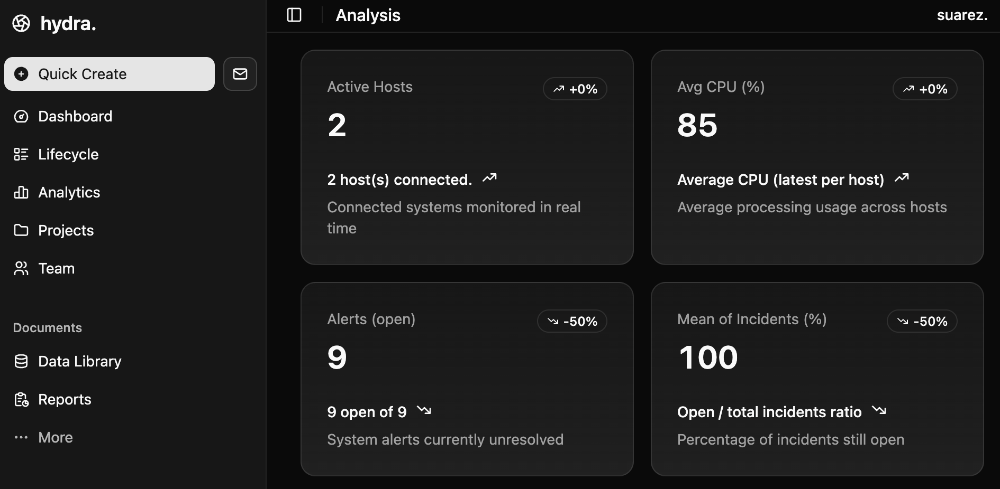
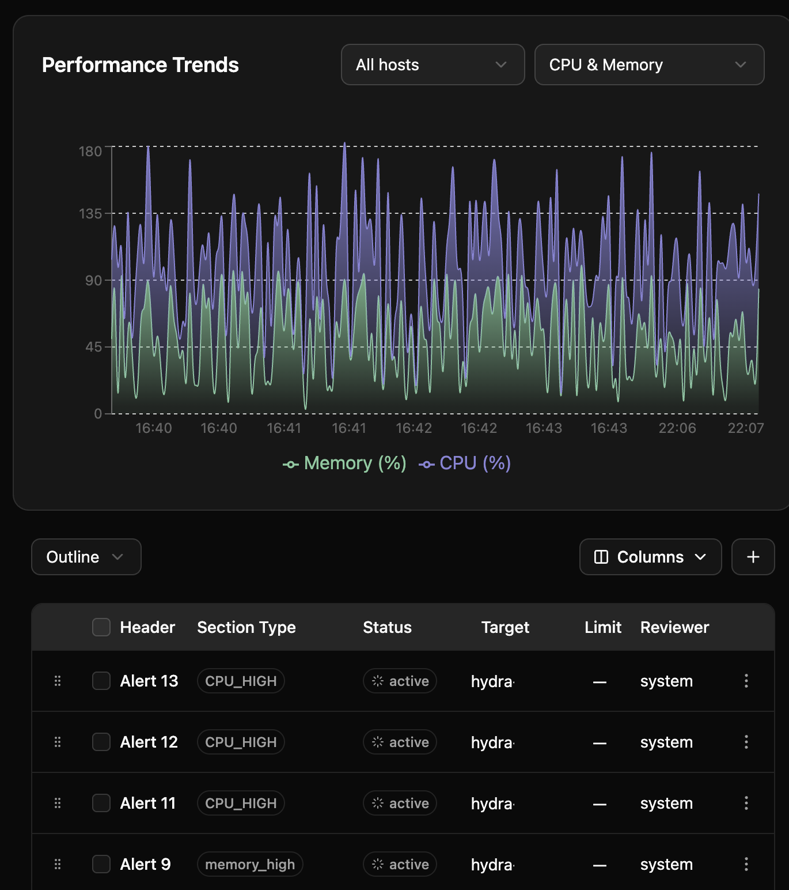

# hydra
Hyper Yielding Dynamic Real-time Analytics.
Full-stack platform for monitoring the performance of systems and services in real time, automatically detecting anomalies, and predicting failures through time series analytics and machine learning.




## What It Solves

Infrastructure monitoring tools are either overly complex enterprise suites (Datadog, New Relic) or basic open-source dashboards (Prometheus + Grafana) that require extensive manual configuration. HYDRA bridges this gap by delivering an all-in-one, self-hosted platform that:

- Collects metrics, logs, and traces from any source (Kubernetes, Docker, bare metal, cloud VMs).
- Performs real-time anomaly detection on time series data using lightweight ML models (Isolation Forest, Prophet, LSTM autoencoders).
- Predicts resource exhaustion, service degradation, or hardware failures hours in advance.
- Scales horizontally with zero-downtime deployments and built-in high availability.
- Reduces MTTD/MTTR by up to 70% through automated root cause suggestions and intelligent alerting.

HYDRA is production-ready for SMEs, startups, and homelabs, while remaining fully extensible for enterprise use cases.

## Features

- **Unified Data Ingestion**: Native agents for Linux/Windows/macOS + OpenTelemetry compatibility.
- **Real-Time Dashboards**: Interactive Grafana-like UI with drag-and-drop panels, built on React + WebSockets.
- **Anomaly Detection Engine**: ML-powered detectors for CPU, memory, disk, network, and custom metrics.
- **Predictive Analytics**: Forecasting models (ARIMA, Prophet, NeuralProphet) with confidence intervals.
- **Alerting & Automation**: Multi-channel notifications (Slack, Email, PagerDuty, webhook) + auto-remediation scripts.
- **Root Cause Analysis**: Correlation engine that links anomalies across services, pods, and hosts.
- **Self-Healing Hooks**: Optional integration with Kubernetes (auto-scale), Ansible, or Terraform.
- **Security & Compliance**: Role-based access control (RBAC), audit logs, data encryption at rest/transit.
- **Extensibility**: Plugin system for custom collectors, models, and exporters.
- **Deployment Options**: Docker Compose (dev), Kubernetes Helm chart (prod), or bare metal.

## Tech Stack

- **Backend**: FastAPI (Python 3.11+) + WebSockets + Redis Stream
- **Frontend**: React 18 + TypeScript + Tailwind CSS + Recharts
- **Time Series DB**: VictoriaMetrics (Prometheus-compatible, 10x compression)
- **ML Layer**: scikit-learn, Prophet, PyTorch (optional GPU acceleration)
- **Queue & Cache**: Redis + Celery Beat for scheduled tasks
- **Deployment**: Docker, Kubernetes, Helm, Terraform modules

## Requirements

- Docker & Docker Compose (recommended) or Kubernetes cluster
- Python 3.11+ (for local development)
- Node.js 20+ & npm (for frontend)
- Optional: NVIDIA GPU + CUDA for deep learning models

## Instalation

1. Repo

```bash
git clone https://github.com/suarezsp/hydra.git
cd hydra
```

2. Backend (localhost:8000)

```bash
cd backend
python3 -m venv venv
source venv/bin/activate  # (Windows: venv\Scripts\activate)
pip install -r requirements.txt
uvicorn app.main:app --reload
# or with generator
HYDRA_GENERATE_METRICS=true HYDRA_GEN_HOSTS="dev1,dev2" HYDRA_GEN_INTERVAL=3 uvicorn app.main:app --reload --port 8000
```

3. Frontend (localhost:5173)

```bash
cd dashboard
npm install
npm run dev
```

4. Docker

```bash
cd infra
docker compose up --build
```

5. Generate sample data

```bash
cd hydra
python backend/scripts/generate_sample_data.py
mv hydra_metrics_sample.csv /backend/samples/
mv hydra_alerts_sample.csv /backend/samples/
```
